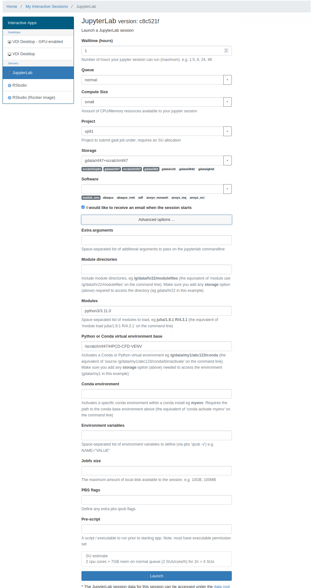

# README #

## Introduction
WaveQLab3D is a open source code for 3D seismic wave propagation and earthquake rupture dynamics. It solves the elastic wave equation in curvilinear coordinates (i.e., complex geometries) with a possibly nonplanar frictional fault interface. The current version supports off-fault viscoplasticity, spatially variable elastic properties, and several friction laws (including rate-and-state and slip-weakening). The original code was developed in the Standford University and is available at [here](https://bitbucket.org/ericmdunham/waveqlab3d).

For this Baseline HPC training, this repository provides executable binaries built specifically for the Gadi Supercomputer infrastructure, focusing on job submission and monitoring on large-scale shared system.

***

## SSH  
Since the executables were built on the target of Gadi infrastructure, downloading should be directed to Gadi system. 

Make sure you can ssh to Gadi shell. 
- **Linux/Mac Users**: Use the following terminal command:
  ```bash
  ssh username@gadi.nci.org.au
  ```
- **Windows Users**, You can use SSH clients like PuTTY or MobaXterm, or access the Gadi Terminal from NCI Web-based platform [ARE](https://are.nci.org.au).

***
## System Specifications

Confirm the specifications of the systems you log into and answer the questions below for each of the systems (_Hint: the commands `lscpu` and `uname -a` and the contents of `/proc/cpuinfo` and `/proc/meminfo` might be helpful_)

*   What is the name of the machine you are using?
*   What operating system and what version of it is running? How did you tell?
*   How many CPUs does it have, and how did you determine this?
*   What processor is present on this machine, what is its frequency (MHz), and how did you determine this information?

* * *

## Downloading the Code
Once you land on the Gadi log-in node

```bash
# Create and navigate to a directory under /scratch/nf47
$ mkdir /scratch/nf47/$USER/ && cd "$_"

# Clone the repository
$ git clone https://github.com/nci900/HPCD-CFD-WaveqLab3D.git
```

***
## Repository Walkthrough
The repository has a few subdirectories:
 - `src`: Source files (no modifications required)
 - `inputfile`: Inputfiles that set up the physical problem, mesh size, parameters for numerical schemes etc. (no modifications required)
 - `cmake`: CMake files for test problems (no modifications required)
 - `test_problems`: Test problems (no modifications required)
 - **`build_CascadeLake`**: Directory containing executables for running on Gadi Cascade Lake nodes
 - **`build_SapphireRapids`**: Directory containing executables for running on Gadi Sapphire Rapids nodes

***

 ## Task 1: Build and Run Simulations
 In this workshop, you are asked to submit simulations to run on two different CPU hardware, namely Intel Cascade Lake (2nd Gen) and Intel Sapphire Rapids (4th Gen).
 ### On Cascade Lake nodes ###
  The application executable is provided to you in dirctory **build_CascadeLake** together with the job submission script. 

 _Objective: Launch the simulation PBS (the job scheduler) and inspect the output data._

Answer the following questions

*    What is the queue type?
*    How many cores and memory is requested for this job?
*    What's the maximum requested time to run the application i.e. walltime?
*    Which storage spaces are accessible to this job?
*    Which MPI implementation is used for parallelising this simulation?


```bash
#To submit the job, navigate to dirctory build_CascadeLake
$qsub job_run_CL.sh

#Once the job ID returns, you query the job by
$qstat -snw
```

### On Sapphire Rapids nodes ###
Now, we want to run the simulation on the latest Sapphire Rapids nodes. This requires the application build to be aware of the hardware; for example, if you want to use the SR nodes, older compilers won't necessarily know the instructions and optimizations on newer CPUs

 _Objective: Build and run the executable binary on Sapphire Rapids nodes_

 ```bash
 # Load the appropriate compiler and mpi library
 $ module load intel-compiler-llvm/2023.2.0 intel-mpi/2021.8.0

 # Generate the build under directory build_SapphireRapids
 $ cmake -DCMAKE_BUILD_TYPE=Release ../src/

 # Compile the code
 $ make -j 4 

 ```
 
Before we run the simulation, inspect **job_run_SR.sh**. Answer the same questions again

*    What is the queue type?
*    How many cores and memory is requested for this job?
*    What's the maximum requested time to run the application i.e. walltime?
*    Which storage spaces are accessible to this job?
*    Which MPI implementation is used for parallelising this simulation?

Run the simulation on Sapphire Rapids node

```bash
# navigate to directory build_SapphireRapids
$qsub job_run_SR.sh

#Once the job ID returns, you can query the job by
$qstat -snw
```
***

## Task 2 Plot the data output
Upon job completion, the seismic wave simulation data will be stored in `build_CascadeLake/data` and `build_SapphireRapids/data`, respetively.

Using NCI's web-based graphical interface ARE (short for Australian Research Environment), you can visualize the data in-situ. Head to [ARE](https://are.nci.org.au) and select JupyterLab, the you will the panel as showing below
 

The Jupyterlab is scripted to run on Gadi at backend, and automatically port forwarding through ARE. Specify the session characteristics as follows:
```
Walltime: 1

Queue: normal (Note that this needs to be typed in)

Compute Size: Small

Project: nf47

Storage: gdata/nf47+scratch/nf47

(In Adavanced options)

Modules: python3/3.11.0

Python or Conda virtual environment base: /scratch/nf47/HPCD-CFD-VENV

```

 Hit Launch and wait until the job starts. Once the JupyterLab spins up at your local browser, find the jupyter notebook **`Post-Processing.ipynb`** and go through the cells (_Hint: Shift+Enter runs the cells_). 


